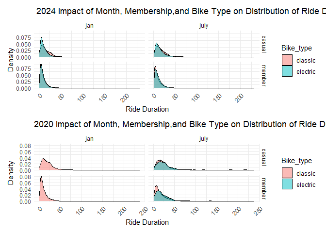

Homework 3
================
Sarahy Martinez
10/13/2023

``` r
library(tidyverse)
library(ggridges)
library(hexbin)
library(patchwork)


theme_set(theme_minimal()+ theme(legend.position = "bottom"))

options(
  
  ggplot2.continuous.colour = "viridis",
  ggplot2.continuous.fill = "viridis"
)

scale_fill_discrete = scale_fill_viridis_d()    

scale_colour_discrete = scale_fill_viridis_d() 
```

# Problem 1

``` r
library(p8105.datasets)
```

reading in data

``` r
data("ny_noaa")
```

This dataset has 2595176 rows and 7 columns. Variables include weather
station id, date of observation, (tenths of mm), snowfall (mm), snow
depth (mm), and min and max temperature (tenths of degrees C).

``` r
ny_noaa %>% 
  count(snow) %>%
  arrange(desc(n))
```

    ## # A tibble: 282 × 2
    ##     snow       n
    ##    <int>   <int>
    ##  1     0 2008508
    ##  2    NA  381221
    ##  3    25   31022
    ##  4    13   23095
    ##  5    51   18274
    ##  6    76   10173
    ##  7     8    9962
    ##  8     5    9748
    ##  9    38    9197
    ## 10     3    8790
    ## # ℹ 272 more rows

``` r
ny_noaa = 
  ny_noaa %>% 
  separate(date, into = c("year", "month", "day"), convert = TRUE) %>% 
  mutate(
    tmax = as.numeric(tmax),
    tmin = as.numeric(tmin))
```

``` r
ny_noaa %>% 
  group_by(id, year, month) %>% 
  filter(month %in% c(1, 7)) %>% 
  summarize(mean_tmax = mean(tmax, na.rm = TRUE, color = id)) %>% 
  ggplot(aes(x = year, y = mean_tmax, group = id)) + geom_point() + geom_path() +
  facet_grid(~month) +
  labs(title = "Mean monthly temperature for each station across years for January and July")
```

<!-- -->

``` r
hex = 
  ny_noaa %>% 
  ggplot(aes(x = tmin, y = tmax)) + 
  geom_hex()

ridge = 
  ny_noaa %>% 
  filter(snow < 100, snow > 0) %>%
  ggplot(aes(x = snow, y = as.factor(year))) + 
  geom_density_ridges()

hex + ridge
```

<!-- -->

# Problem 2A

Reading In, Cleaning, Combining Data

``` r
#reading in data and cleaning 
accelerometer_data = read_csv(file = "./data/nhanes_accel.csv", na = c("", "NA", 999)) %>%
  janitor::clean_names() %>%
  mutate(seqn=as.character(seqn)) %>% 
  drop_na()


demographics_data = read_csv(file = "./data/nhanes_covar.csv",na = c("", "NA", 999),
                    skip = 4, col_names =TRUE) %>% 
                    janitor::clean_names() %>% 
                     mutate(seqn=as.character(seqn)) %>% 
                    filter(age >=21) %>% 
                    drop_na()

combined_nhanes = 
  left_join(accelerometer_data, demographics_data, by= "seqn") %>% 
  janitor::clean_names() %>%
  relocate(seqn,sex,age,bmi,education) %>%          
  mutate(sex = recode(sex, "1"= "male", "2"= "female")) %>% 
   mutate(sex= as.factor(sex)) %>% 
          mutate(education=recode(education,
                                  "1"="Less than High School", 
                                  "2"="High School Equivalent", 
                                  "3"="More than High School")) %>% 
  mutate(education= fct_relevel(education, "Less than High School", "High School Equivalent", "More than High School")) %>% 
  drop_na(sex,age,bmi,education)
```

## 2B Producing reader friendly table for number of men and women in each education category

``` r
combined_nhanes %>% 
            group_by(sex,education) %>% 
            summarize(counts= n()) %>% 
            pivot_wider(
              names_from = education,
              values_from = counts,
              names_prefix = "Education "
            ) %>% 
  knitr::kable()
```

| sex    | Education Less than High School | Education High School Equivalent | Education More than High School |
|:-------|--------------------------------:|---------------------------------:|--------------------------------:|
| female |                              28 |                               23 |                              59 |
| male   |                              27 |                               35 |                              56 |

Based on this output more men have a high school equivalent education
whereas more women either have less than a high school education or more
than a high school education but they do not vary as much from the men.

Age Distributions of each category

``` r
 demo_data= combined_nhanes %>% 
  select(age,sex,education) %>% 
  filter(age>=21) %>% 
  drop_na()


ggplot(demo_data, aes(x = age, fill = sex)) + 
  geom_density(alpha = 0.5) + 
  facet_grid(. ~ education) +
  theme_minimal()+
   labs(
    title = "Age Distributions of Sex and Education Level",
    x = "Age",
    y= "Density"
  )
```

<!-- --> For this plot, I
used a density graph to demonstrate the distributions of age, sex, and
education level. We can see that females between the ages 20 and 40 have
an education greater than high school in comparison to men. Whereas men
have also who have more than a high school degree are 20-40 but there
are not as many. Additionally, those who have less than a high school
degree begin to somewhat overlap between men and women around 60-80 and
lastly for high school equivalent women tended to be between 60 and 80
whereas mean were 20-40.

## Problem 2C Aggregating Across Minutes to Create Total Activity

``` r
 aggregate_data = combined_nhanes %>% 
  mutate(total_activity= rowSums(select(.,starts_with("min")))) %>% 
  select(total_activity, age, sex, education)


ggplot(aggregate_data, aes(x=age, y=total_activity, color=sex))+
  geom_point(alpha= .5)+
  geom_smooth(se= FALSE)+
  facet_grid(. ~ education)+
  labs(
    title = "Age vs Total Activity Among Men and Women Varying By Education",
    x = "Age",
    y= "Total Activity"
  )
```

<!-- --> In this graph we
can see a commonality in the slope changes, all educations have a
negative slope. This implies that as age increases amount of total
activity increases among all of the education categories. However, we
can note that for women who have a high school equivalent education
their total physical activity drops tremendously between the ages of 40
and 60 whereas men in the less than high schools education physical
activity drops tremendously after the ages 60-80. Another commonality is
that at around age 80 across the education levels men and women have
about the same amount of total activity being about 10,000 min.

## Problem 2D

Three panel plot showing 24 hour activity time course

``` r
activity_twenty_four_hour = combined_nhanes %>%
  pivot_longer(
    cols = starts_with("min"),
    names_to = "minute", 
    values_to = "activity",
    names_prefix = "min") %>%
  mutate(minute = as.numeric(minute)) %>% 
  mutate(hour= minute/60) 

ggplot(activity_twenty_four_hour, aes(x=hour, y= activity, color=sex, group =seqn))+
  geom_smooth(aes(group = sex),se= FALSE)+
  facet_grid(. ~ education)+
  labs(
    title = "24- Hour Activity Time by Education Attainment",
    x = "Hours",
    y= "Actvity"
  )
```

<!-- --> Based off
of this graph we can see that within 24 hours that amount of activity
for men and women overlap a bit between those who attained less than
high school education from 5-10 hrs, for high equivalent women have
higher amounts of activity than men, lastly form more than high school
education women differ largely from men ( they are more active).
However, in the end throughout all levels of education, women and men
activity decline at about the same amount of hours which are 20-25, this
can possibly due to the time they are asleep. Furthermore, the graphs
have meaning because they follow a sleep cycle in which hours 0-5 people
are asleep and then everyone is active between working hours 6-15, this
is a commonality across all.

# Problem 3

## problem 3 part 1

Importing the data

``` r
jan_2020 = read_csv(file = "./data/Jan_2020_Citi.csv", na = c("", "NA", 999)) %>% 
  janitor::clean_names() %>% 
  mutate(month_year = "jan_2020") %>% 
  drop_na()

jan_2024 = read_csv(file = "./data/Jan_2024_Citi.csv", na = c("", "NA", 999)) %>% 
  janitor::clean_names()%>% 
  mutate(month_year = "jan_2024") %>% 
  drop_na()

july_2024 = read_csv(file = "./data/July_2024_Citi.csv", na = c("", "NA", 999)) %>% 
  janitor::clean_names() %>% 
  mutate(month_year = "july_2024") %>% 
  drop_na()


july_2020 = read_csv(file = "./data/July_2020_Citi.csv", na = c("", "NA", 999)) %>% 
  janitor::clean_names() %>% 
  mutate(month_year = "july_2020") %>% 
  drop_na()


combined_years_data =  
  bind_rows(jan_2020, jan_2024, july_2020, july_2024) %>% 
  janitor::clean_names() %>% 
   mutate(rideable_type = recode(rideable_type, 
                                "classic_bike" = "classic",
                                "electric_bike" = "electric")) %>% 
  mutate( weekdays= factor(weekdays),
          weekdays= forcats:: fct_relevel(weekdays,
                                          "Monday", 
                                          "Tuesday",
                                          "Wednesday", 
                                          "Thursday", 
                                          "Friday",
                                          "Saturday", 
                                          "Sunday"), 
          member_casual = factor(member_casual),
          member_casual = forcats::fct_relevel(member_casual, 
                                               "casual",
                                               "member"),
          rideable_type = factor(rideable_type),
          rideable_type = forcats::fct_relevel(rideable_type,
                                               "classic",
                                               "electric"),
          duration = as.numeric(duration)) 
```

Reader friendly table

``` r
# producing reader friendly table 

combined_years_data %>% 
separate(month_year, into = c("month", "year"), sep = "_") %>% 
  group_by(month, year, member_casual) %>% 
  summarise(total_rides = n()) %>% 
  pivot_wider(
    names_from = "member_casual",
    values_from = "total_rides"
  ) %>% 
  knitr::kable()
```

    ## `summarise()` has grouped output by 'month', 'year'. You can override using the
    ## `.groups` argument.

| month | year | casual | member |
|:------|:-----|-------:|-------:|
| jan   | 2020 |    980 |  11418 |
| jan   | 2024 |   2094 |  16705 |
| july  | 2020 |   5625 |  15388 |
| july  | 2024 |  10843 |  36200 |

## problem 3 part 2

table of the 5 most popular starting stations for july 2024 + number of
rides

``` r
combined_years_data %>% 
  filter(month_year =="july_2024") %>% 
select(-month_year)%>% 
  group_by(start_station_name ) %>% 
  summarise(total_rides = n())%>% 
  arrange(desc(total_rides)) %>% 
  slice(1:5) %>% 
  knitr::kable(
    col.names = c("Start Station", "Ride Total")
  )
```

| Start Station            | Ride Total |
|:-------------------------|-----------:|
| Pier 61 at Chelsea Piers |        163 |
| University Pl & E 14 St  |        155 |
| W 21 St & 6 Ave          |        152 |
| West St & Chambers St    |        150 |
| W 31 St & 7 Ave          |        145 |

## problem 3 part 3

``` r
med_duration = combined_years_data %>% 
  group_by(weekdays, month_year) %>% 
  summarise(median_duration = median(duration, na.rm = TRUE))
  

  
ggplot(med_duration, aes(x = weekdays, y=median_duration, fill=month_year)) +
         geom_bar(stat = "identity", position = "dodge")+
  facet_grid(.~year) %>% 
  labs(
     title = "Median Ride Duration by Day of the Week, Month, and Year",
    x = "Day of the Week",
    y = "Median Ride Duration (min)",
    fill = "Month"
  ) +
  theme_minimal()+
   theme(axis.text.x = element_text(angle = 45, hjust = 1),
  legend.position = "right")
```

<!-- --> From this
graph we can see that the month of July has the greatest amount of
median duration throughout the weekdays, they are most significant
around the weekend. More specifically, July 2020 has the highest amount
of ride duration throughout all weekdays but it is also highest on the
weekend. Additionally, we can see that the median ride duration for the
month of January in 2020 and 2024 is less than July 2020 and 2024. This
can possibly be due to the seasons, July is warmer and January is
colder.Another inference we can make for July 2020 and Jan 2020 having
higher ratesof ride duration than Jan and July 2024 is because of COVID,
more people were becoming active due to quarantine.

## problem 3 part 4

``` r
twenty_four = combined_years_data %>% 
    separate(month_year, into = c("month", "year"), sep = "_") %>%  
  mutate( month = factor(month),
          month= forcats:: fct_relevel(month, "jan", "july"), 
          year= as.numeric(year)) %>% 
  filter( year == 2024) %>% 
  select(month,member_casual,rideable_type, duration)


twenty_twenty = combined_years_data %>% 
    separate(month_year, into = c("month", "year"), sep = "_") %>%  
  mutate( month = factor(month),
          month= forcats:: fct_relevel(month, "jan", "july"), 
          year= as.numeric(year)) %>% 
  filter( year == 2020) %>% 
  select(month,member_casual,rideable_type, duration)


twenty_four_plot = ggplot(twenty_four, aes(x = duration, fill= rideable_type)) +
         geom_density(alpha = 0.5)+
  facet_grid(member_casual ~ month) +
  labs(
     title = " 2024 Impact of Month, Membership,and Bike Type on Distribution of Ride Duration",
    x = " Ride Duration",
    y = "Density",
    fill = "Bike_type"
  ) +
  theme_minimal()+
   theme(axis.text.x = element_text(angle = 45, hjust = 1),
  legend.position = "right")


twenty_twenty_plot = ggplot(twenty_twenty, aes(x = duration, fill= rideable_type)) +
         geom_density(alpha = 0.5)+
  facet_grid(member_casual ~ month) +
      labs(
     title = "2020 Impact of Month, Membership,and Bike Type on Distribution of Ride Duration",
    x = " Ride Duration",
    y = "Density",
    fill = "Bike_type"
  )+
  theme_minimal()+
   theme(axis.text.x = element_text(angle = 45, hjust = 1),
  legend.position = "right")

(twenty_four_plot / twenty_twenty_plot)
```

<!-- -->

Patch worked the two graphs of 2020 and 2024 to compare differences in
use of classic and electric bike among casual and member riders. I used
a density graph to to show the distribution of ride duration. We can see
that in 2020 of January electric bikes were not used at all, this can
possibly due to them not being used as common or COVID and people wanted
more physical activity. Then in July 2020 we can see that that electric
bikes begin to be used but members are using classic bikes a bit more
than casual riders. We can also see in July 2020 that casual members use
classic bikes and electric bikes more equally. When we compare to 2024
we can observe that Jan 20204 both casual and members are using electric
bikes more and this is also observed in July 2024 as well.
